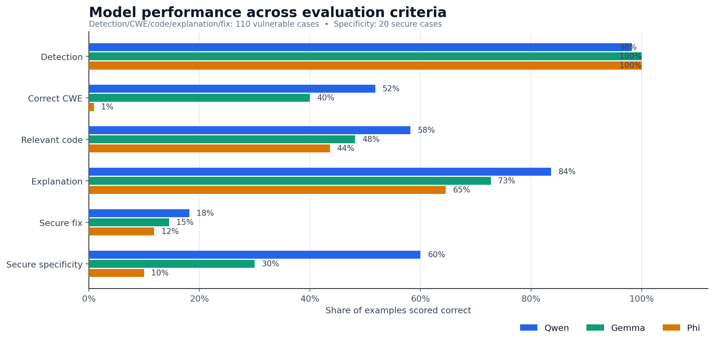
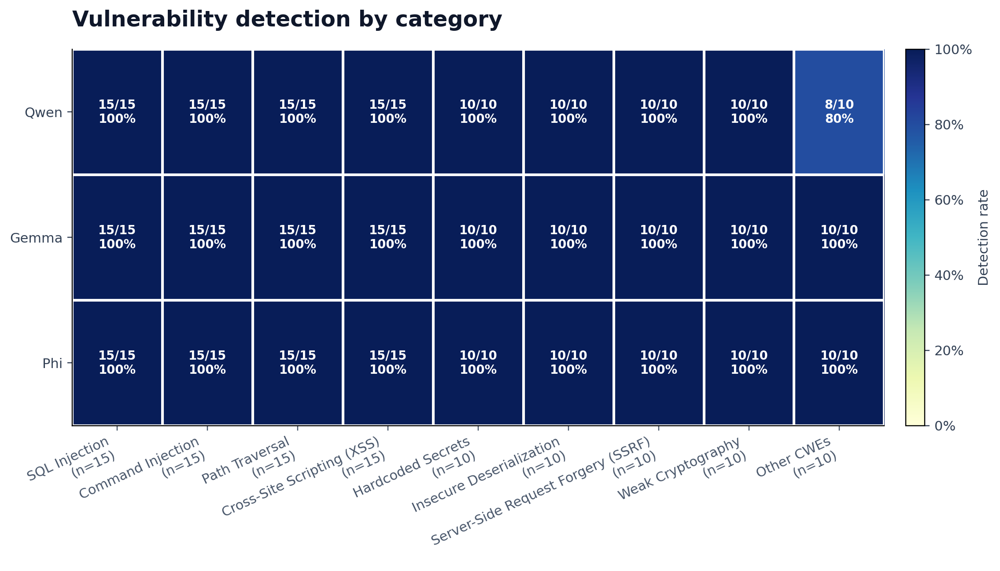
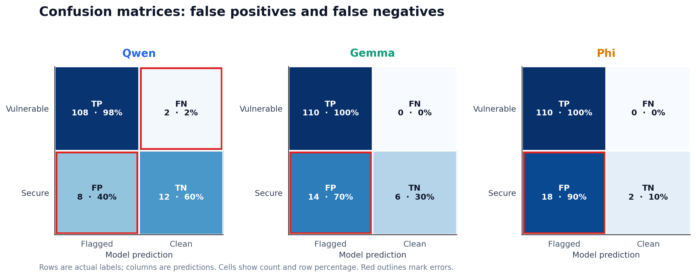
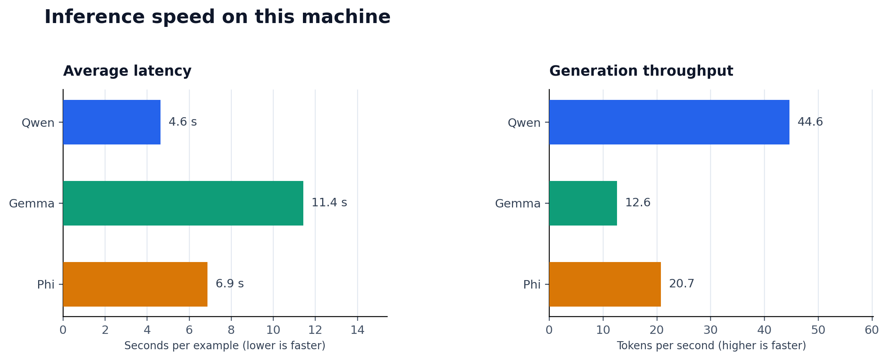

# Evaluation visuals

These charts summarize the completed run over 110 vulnerable and 20 secure examples. Detection, CWE, code, explanation, and fix are scored on vulnerable examples; specificity is scored on secure examples. Explanation and fix scores use keyword heuristics.

## Model performance

## Detection by category

## False positives and false negatives

## Inference speed

PNG files are convenient for slides; matching SVG files are available for editing and scaling.
